# Creating a CrowdFunding Application with the Algorand Blockchain

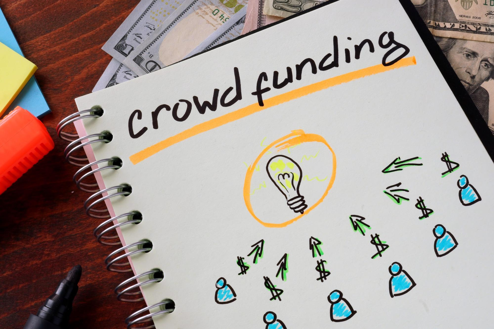

##Introduction

This solutions article describes the implementation of a next-generation crowdfunding Application using the Algorand Blockchain.

##Crowdfunding

Crowdfunding allows raising funds for a project through many people connected over the internet.  The crowdfunding concept emerged in 1997 when a British band funded a reunion tour through online donations from their fans.  In 2011, the JOBS Act legalized equity crowdfunding in the US.  Companies like Kickstarter and Fundable have created a multi-billion dollar market for crowdfunding, enabling the launch of many projects that may have otherwise not received funding. In 2019, KickStarter helped fund 187,010 projects with 5.6 million investors and $5.23 billion invested.

While the internet has enabled crowdfunding, there is still more that can be done.  Most crowdfunding systems use credit cards for payment.  Credit card fees average 3.5%. For a $1 million project, that results in a loss of $35,000 that would otherwise go to the project creator.  Also, using credit cards for payment excludes roughly 80% of the adults around the world who don’t have a credit card.  Crowdfunding management overhead also eats into funding.  For example, KickStarter charges a 5% fee.

Many crowdfunding systems are curated, centralizing control of who can create a crowdfunding project and the types of projects deemed acceptable.  

This article shows how to apply the Algorand blockchain to create a next-generation decentralized crowdfunding service that is open, scalable, secure, automated, and cost-effective. 

##Algorand

Algorand is a 3rd generation blockchain that uses an efficient proof of stake consensus protocol.  It is public, secure, scalable, energy-efficient, and fast with a throughput of 1,000 transactions per second (TPS). Transactions are processed and finalized within 5 seconds, and with nominal transaction fees currently less than a 10th of a penny.  Algorand features layer one support for assets, atomic swaps, and smart contracts.  These features combine to create a platform well suited for creating sophisticated and efficient decentralized financial systems.  

Algorand is also open and borderless.  Anyone with a smartphone can participate in the Algorand network.  Over 6 million users are participating in the Algorand network. 

##Crowdfunding Requirements

The requirements for our crowdfunding system are as follows:

###Project Diversity

The crowdfunding system should be open for any type of project or cause.  Examples of project creators include farmers, artists,  students, entrepreneurs, politicians, governments, businesses, environmentalists, and others.  

###Global and Borderless

The crowdfunding system must be open to project creators and investors (i.e., backers) from around the world.

###Efficient

The crowdfunding system should be efficient.  The cost and fees required to participate should be nominal. 

###Secure

The system must be secure and equitable, protecting the funds raised.  

##Workflow

The general approach to the solution follows.

###Defining a Crowdfunding Project

Defining the crowdfunding project is the first step.  The project creator specifies the name of the project, description, fundraising goal, and timeline.  

###Timeline

The crowdfunding project timeline has a start date, end date, and a close date.  The start date determines when the project becomes open to investments.  The end date closes the fund for additional investments and also enables the distribution of funds.  Funds are made available to the project creator if the goal is met, otherwise the funds can be reclaimed by the individual investors.  The following state machine describes the crowdfunding states.

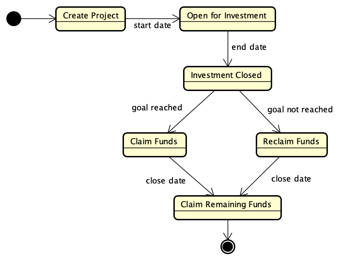

_Crowdfunding state machine diagram_

###Escrow Account

Each crowdfunding project will use an escrow account to hold the investments collected for the project.  The escrow account will accumulate investments from the start date and until the end date.  

###Competing the Fundraising

After the end date,  the project creator can claim the funds collected in the escrow account if the fundraising goal is attained. Otherwise, investors can reclaim their investments.  At the close date, any funds remaining in the escrow account can be claimed by the project creator.   

Note that it is possible to support variations on how funds are distributed.  For example, even if the fund does not reach its goal, distribute all funds collected to the project creator.  

##Design

The crowdfunding system uses a modular design composed of the following components. 

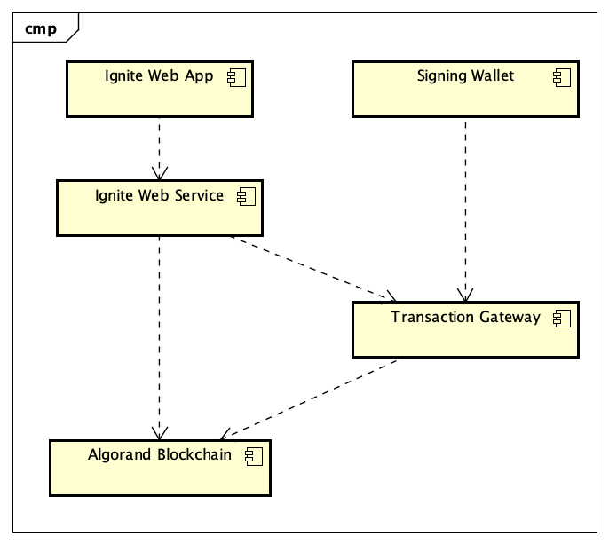

_Ignite Crowdfunding Component Diagram_

The Ignite Web Application provides the user interface for the crowdfunding application.  The Ignite Web Service implements the application logic to support the crowdfunding workflow.  The Transaction Gateway orchestrates transaction signing.  The Signing Wallet provides secure transaction signing for investors.  The Algorand Blockchain supports the secure management of funds, including creating assets, managing accounts, processing smart contracts, and submitting transactions. 

###Ignite Web Application

The Web Application provides an intuitive and easy to use interface.  The following use case diagram shows the actors and supported use cases. 

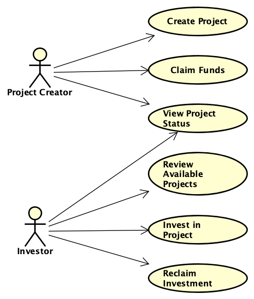

_Crowdfunding use case diagram_

The project creator is the person who sets up a crowdfunding project.   The project creator creates the project, and then, when the crowdfunding is complete,  claims the funds collected from investors if the fund reaches its goal.  Investors review available projects looking for investment opportunities, and invest in projects.  If a project fails to reach its goal, investors can reclaim their investment in that project (until the closing date).  During the life of the project, both project creators and investors can monitor a project’s status.

The following screenshot shows the project creation page, where a project creator can define a new project, specifying its name, description, and funding goal.  The web application supports setting the funding goal in different currencies, including Algo, USDC, and USDT.  USDC and USDT are US dollar-backed stable coins supported on the Algorand blockchain.  The stability provided by US dollar stable coins is a useful feature for a crowdfunding system since it avoids the volatility associated with cryptocurrencies.  Finally, the project account is specified, this is the Algorand account that will issue the transactions to create the project and then claim the funds at its successful conclusion.  The time limit specifies the duration of the crowdfunding and is used to compute the end date based on the current date.  The close date is 2X the duration.  

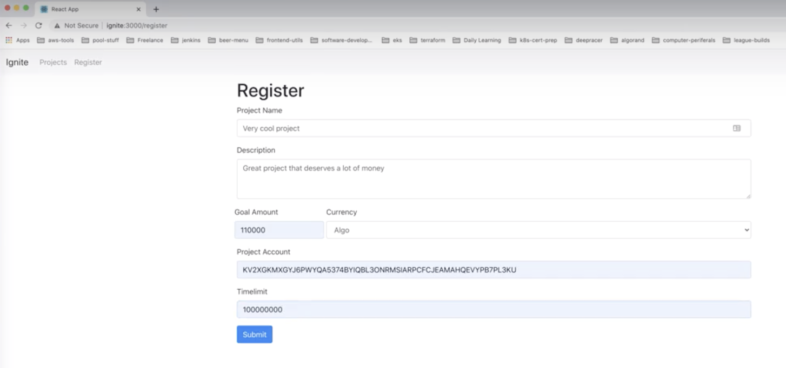
_Project creation_

The projects page allows users to view the active projects.  

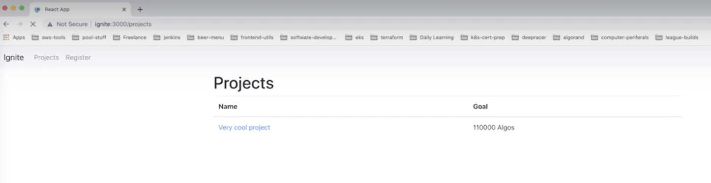

_Viewing available projects_

Selecting a project provides the ability to invest in the project.  

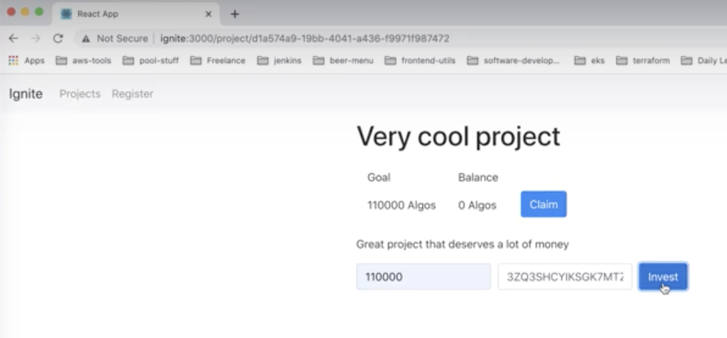

_Investing in a project_

Once the funding project reaches its end date and funding goal, the project creator can claim the funds.  Claiming funds transfers the collected investments from the fund’s escrow account to the project creator’s account, where the funds are immediately available for use by the project.

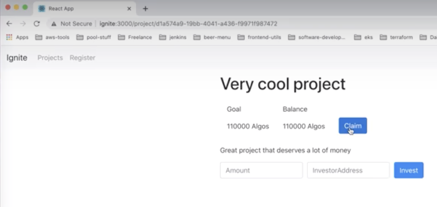

_Project creator claiming the funds after the end date_

###Ignite Web Service

The Ignite Web Service is a REST-based service that supports the project funding lifecycle, including creating the project, processing investments, and claiming or reclaiming funds.  It is implemented in Java using the DropWizard framework. The Algorand Java SDK is used to integrate with the Algorand blockchain. 

The web service supports the Web Application workflow.  It creates the required transactions and submits those to the Transaction Gateway.  The following class diagram shows the Service API (blue) and the domain classes (yellow).   The class Fund represents an instance of a project.  The Investment class models investments received from investors.  

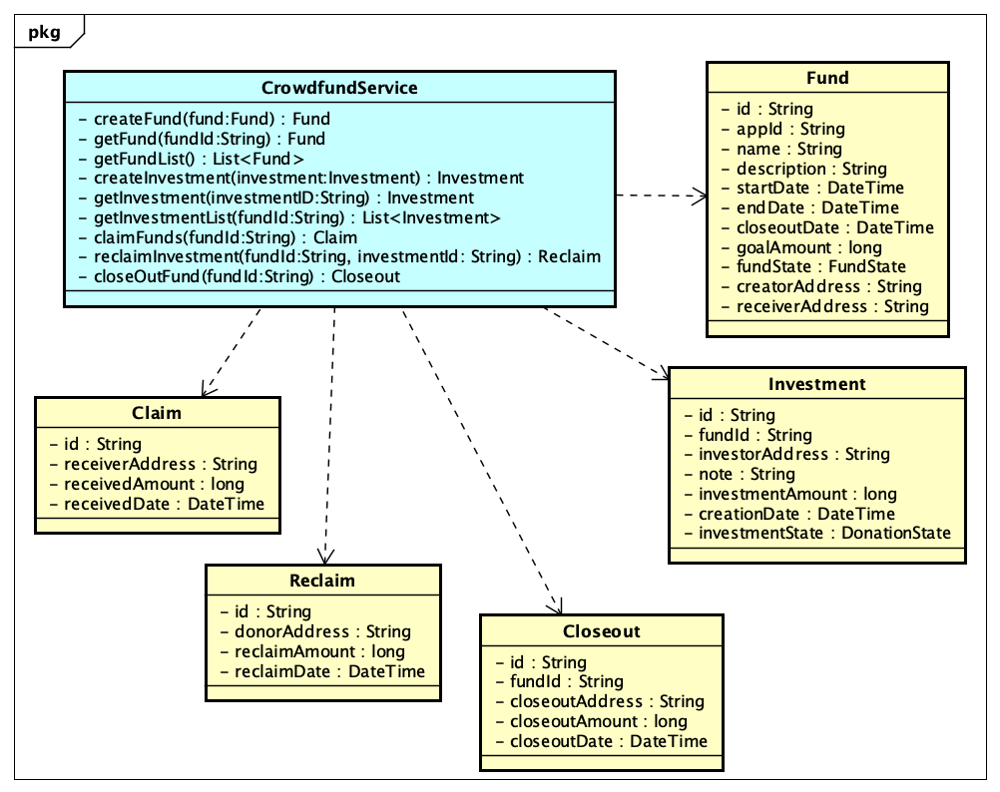

_Crowdfunding service and domain model_

###Transaction Gateway

The Transaction Gateway orchestrates routing of transactions to wallets for signing.  Once signed, the Transaction Gateway commits the transactions to the blockchain and notifies the sender and receiver.

The Transaction Gateway routes the transaction to the investor’s signing wallet. The investor uses their signing wallet to sign the transactions required for their investment.  Due to the efficiency and low cost of the Algorand blockchain, the transaction fees are negligible (less than 1/10th of a penny).  

###Signing Wallet

The signing wallet securely manages the user’s accounts and private keys and supports signing transactions. The signing wallet notifies the user of when new transactions requiring signing are received.  Once the user has reviewed and signed the transaction, the wallet returns the signed transactions to the Transaction Gateway. 

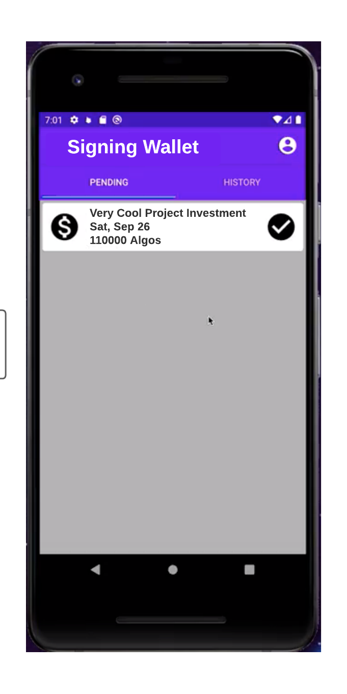

_Mobile signing wallet used by investors to sign investment transactions_

###Algorand Blockchain

The Algorand blockchain supports defining assets (ASAs), representing fungible assets, including Algo, USDT, and USDC.  Assets provide the investment currency for the funding projects.  

Stateful TEAL is a smart contract language that allows maintaining global and local application state.  A stateful TEAL application manages state as part of the account information.  In the case of the crowdfunding application, the account linked to the application maintains the global state including the fund configuration (goal, start date, end date, close date, and receiver account) as well as the total investment value.  The local state associated with each investor’s account tracks their investment.   

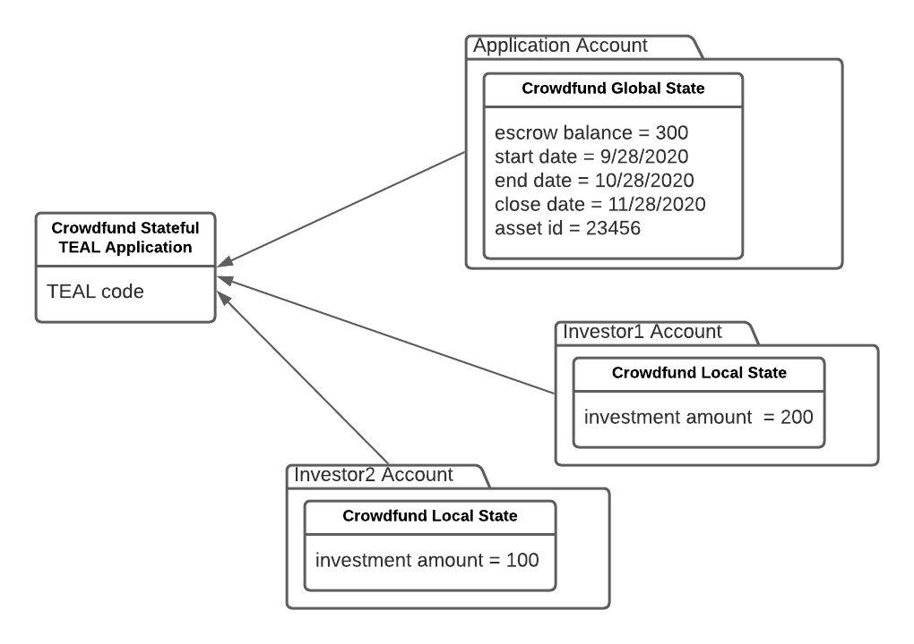

_Crowdfunding Stateful TEAL Application components_

For more details about the Stateful TEAL contracts used in this project, see this Solutions article.

[https://developer.algorand.org/solutions/example-crowdfunding-stateful-smart-contract-application/](https://developer.algorand.org/solutions/example-crowdfunding-stateful-smart-contract-application/)

##Workflow

The following activity diagram explains the crowdfunding workflow.

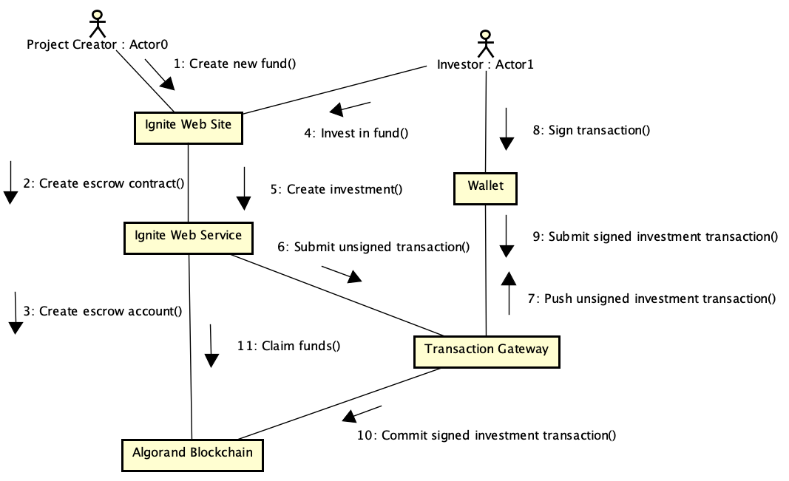

_Crowdfunding workflow where project reaches its goal_

###Steps:

1. A project creator uses the web application to create a new crowdfunding project.
2. The web application calls the Web Service to create a new crowdfunding project.
3. Web service creates a new escrow account and associates it with the stateful TEAL application within the Algorand blockchain.
4. An investor uses the Web application to invest in the fund.
5. The web application calls the web service to create an investment.
6. The web service creates an investment transaction and sends it to the Transaction Gateway.  
7. The Transaction Gateway notifies the signing wallet associated with the investment account that there is a transaction waiting to be signed.
8. The investor uses the signing wallet to inspect and then sign the transaction.
9. The signing wallet returns the signed transaction to the Transaction Gateway.
10. The Transaction Gateway submits the transaction to the Algorand blockchain, which transfers the investment amount from the investor’s account to the escrow account.
11. Finally, at the successful funding conclusion, the project creator claims the funds accrued in the escrow account.  The stateful TEAL contract transfers funds from the escrow account to the project creator's account.

##Summary

This article has shown how the Algorand blockchain allows creating a next-generation crowdfunding service that is decentralized, open, scalable, secure, automated, and cost-effective.

The Algorand blockchain distributes trust across the network; there is no central authority who must be trusted to manage the crowdfunding escrow account properly.  The system is open; anyone with a smartphone and an Algorand blockchain account can create a project or invest in a project.  The system is scalable to 1000 TPS, which is the current throughput of the Algorand network.  A stateful TEAL application (smart contract) automates the crowdfunding project’s management, including controlling when the project funding is active and when funds are claimed or reclaimed.  The system is secure; investors sign and commit transactions for contributions using their mobile signing wallet in conjunction with the Transaction Gateway.  The stateful teal applications keep track of the escrow total and contributions by individual accounts.   Automation combined with the efficiency of Algorand blockchain minimizes transaction fees and overhead.  Almost all of the funds go to the project with nominal administrative costs. 

##Future Enhancements

In this article, we describe the use case where investors contribute to a project as donations.  Future extensions can support investment for equity and lending.

##References

####Ignite Web Application Source Code

[https://github.com/bricerisingalgorand/ignite](https://github.com/bricerisingalgorand/ignite)

####Example Crowdfunding Stateful Smart Contract Application

[https://developer.algorand.org/solutions/example-crowdfunding-stateful-smart-contract-application/](https://developer.algorand.org/solutions/example-crowdfunding-stateful-smart-contract-application/)

####Best Crowdfunding Sites

[https://www.thebalancesmb.com/best-crowdfunding-sites-4580494](https://www.thebalancesmb.com/best-crowdfunding-sites-4580494)

####History of Crowdfunding

[https://www.fundable.com/crowdfunding101/history-of-crowdfunding](https://www.fundable.com/crowdfunding101/history-of-crowdfunding)
